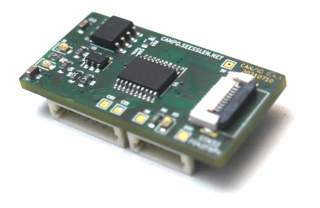

# Liblepto

<div align="center" width="100%" style="vertical-align: middle;" valign="middle">
    
</div>

## Overview

Small general purpose C++ library for microcontrollers like STM32 with flash
sizes down to 16 KByte.

It provides classes for

* Lists
* Ring buffers
* Strings
* Checksums
* Logging
* Signaling
* Testing

Some functions are similar to Qt but very reduced to work on microcontrollers
with down to 16KiB of flash.

(Naming is from 'Leptothorax', a small ant)

## Compile library

To compile the library for a microcontroller, the corresponding toolchain has to
be installed and configured.

The repository is meant to be included into a CMake project as a CMake
subdirectory (`add_subdirectory(liblepto)`) via a Git submodule.

## Compile and run unit tests

Unit tests are automatically compiled when the CMake variable `HOST` is set, or
when the system compiles for an x86_64 target.

```bash
mkdir build_tests
cd build_tests
cmake ..
make -j$(nproc)

./tests/lepto_tests
```

## Generate documentation

There is a Doxygen file for generating documentation out of the source code.
Run `doxygen` directly in the source directory.

```bash
doxygen
```

The documentation will be generated in the folder `doc_generated`. Some images
need to be copied automatically.

```bash
mkdir -p doc_generated/html/doc
cp doc/canio_2.jpg doc_generated/html/doc
```

Now you can open `doc_generated/html/index.html` in your browser.

## Configuration

There are many defines which change the behaviour to scale from larger flash
sizes down to small flash sizes.

Warning: the configuration defines for liblepto have to be the same for all
compiled units. Because they may influence class layout and size, the
application may crash if there is a mismatch of defines.

One way to provide the defines in a common configuration header and include this
in every file via the command line option.

Example for a top-level `CMakeLists.txt` file:

```cmake
add_compile_options(
    "SHELL:-include \"${CMAKE_SOURCE_DIR}/common/config.h\""
)
```

A different possibility is to set the defines directly in `CMakeLists.txt`.
But as the number of defines increases, it may get confusing and the compile
command line becomes long and unreadable.

Example:

```cmake
add_definitions(
    -DLEPTO_LOG_NO_USE_ANSI
    -DLEPTO_CONFIGURED=1
)
```

Have a look in the documentation at `Related Pages/Configuration` for available
defines.

An additional define `LEPTO_CONFIGURED` is checked. This ensures that the
desired configuration is applied correctly and not accidentally defaulted.

## Known issues

* Compiling breaks with no expressive error, only something like "Deleting file 'libfosh/config_generated_fosh.h'"

-> The config header does not contain any entry for the given library. A dummy
   config setting can be added.
