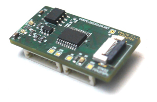

# Liblepto

<div align="center" width="100%" style="vertical-align: middle;" valign="middle">
    
</div>

## Overview

Small general purpose C++ library for microcontrollers like STM32 with flash
sizes down to 16 KByte.

It provides classes for

* Lists
* Ring buffers
* Strings
* Checksums
* Logging
* Signaling
* Testing

Some functions are similar to Qt but very reduced to work on microcontrollers 
with down to 16KiB of flash.

(Naming is from 'Leptothorax', a small ant)

## Compile library

To compile the library for an microcontroller an according toolchain has to be 
installed and configured.

The repository is meant to be included into a CMake project as a CMake 
subdirectory ( 'add_subdirectory( liblepto )' ) via GIT submodule.

## Compile and run unit tests

Unit tests are automatically compiled when CMake variable 'HOST' is set, or the
system compiles for an x86_64 target.

```
mkdir build_tests
cd build_tests
cmake ..
make -j$(nproc)

./tests/lepto_tests
```

## Generate documentation

There is an doxygen file for generating documentation out of the source code. 
Run the doxygen command directly in the source directory.
```
doxygen
```

The documentation will be generated in the folder 'doc_generated'. Some images 
need to be copied automatically.
```
mkdir -p doc_generated/html/doc
cp doc/canio_2.jpg doc_generated/html/doc
```

Now you can open the file 'doc_generated/html/index.html' in your browser.

## Configuration

There are many defines which change the behaviour to scale from larger flash 
sizes down to small flash sizes.

**Warning**
The configuration defines for liblepto have to be the same for all comile units.
Because they may have influence on class layout and size, the application may 
crash if there is an missmatch of defines.

One way to provide the defines in an common configuration header and 
include this in every file via command line option.

Example for top level CMakeLists.txt file:
```
add_compile_options(
   "SHELL:-include "${CMAKE_SOURCE_DIR}/common/config.h"
)
```

A different possibility is to set the defines directly in the CMakeLists.txt. 
But when the amount of defines increase it may get confusing and the command 
line for compiling get very long and unreadable.

Example:
```
add_definitions( 
   -DLEPTO_LOG_NO_USE_ANSI
   -DLEPTO_CONFIGURED=1
)
```

Have a look in into the documentation at 'Related Pages/Configuration' for 
available defines.

An additional define "LEPTO_CONFIGURED" is checked. This ensures that the 
desired configuration is applied correctly and not accidently defaults are used.
